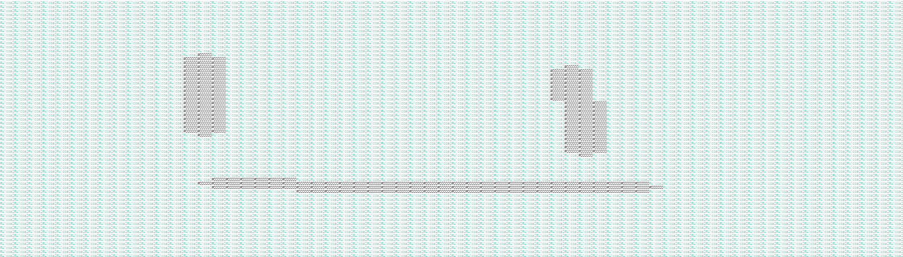

# Reimagining Pixel Art

Given any image, a new picture is created based on the colors of each pixel in the original image. In the interest of speed and memory, any image larger than 256x256 pixels will be scaled down before creating the new image.

for example:
If you start with this image

You'll end up with an image that looks like this

notice that both images are very similar

**Django Project coming soon!**
